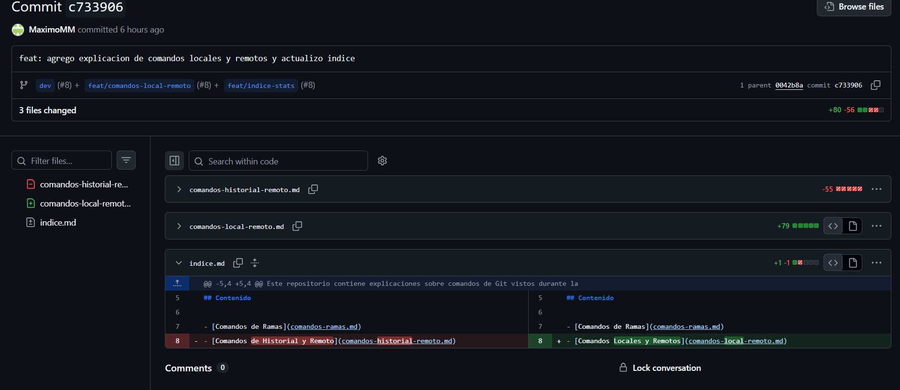
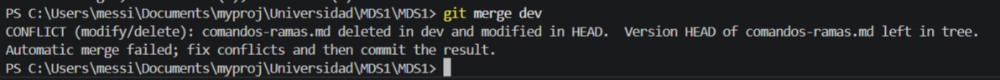
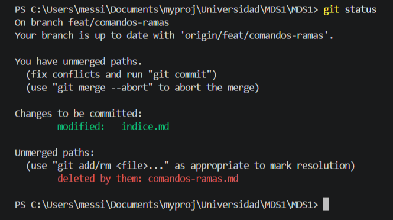

# Estadísticas

## Integrante que realizó la mayor cantidad de commits:
### Máximo Messina (22 Commits)

* **Comando Utilizado:**

    ```bash
    git shortlog -s -n
    ```

    *El flag -s es para mostrar solo la suma, y -n los ordena.*

---

## Cantidad total de merges realizados
### 12 Merges realizados

* **Comando Utilizado:**

    ```bash
    git log --merges --oneline
    ```

---

## Cantidad de conflictos producidos
### No encontramos un comando que devuelva esta estadística

---

## Cantidad de ramas existentes en el repositorio
### 6 Ramas existentes

* **Comando Utilizado:**

    ```bash
    git branch -r
    ```

---

## Commit con la mayor cantidad de archivos modificados
* **Hash:** c733906

* **Cantidad archivos involucrados:** 3



* **Comando Utilizado:**

    ```bash
    git log --stat --oneline    
    ```

---

## Captura de un conflicto previo a su resolución
### Hash del commit asociado: c273d2e



